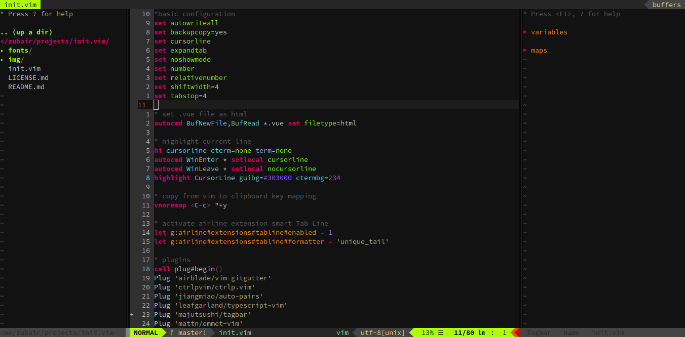

#nvim/init.vim
ini.vim is simple neovim configuration file, contains basic settings and some neccessary plugins to change UI and autocompletion features.

## Getting Started
Install necessary softwares copy init.vim file to your computer and rock!!!

### Prerequisites
You have to install [cURL](https://curl.haxx.se/) and [vim-plug](https://github.com/junegunn/vim-plug).

### Installing
paste follwing code in ubuntu terminal to install curl

```
sudo apt install curl
```

copy follwing code and paste in ubuntu terminal to install vim-plug

```
curl -fLo ~/.local/share/nvim/site/autoload/plug.vim --create-dirs \
    https://raw.githubusercontent.com/junegunn/vim-plug/master/plug.vim
```

after completing installation download init.vim file and move it to follwing place in your home directory

```
/.config/nvim/init.vim
```
restart neovim and run `PlugInstall` command, That's it.

## Screeshot


## Author
* **Zubair Akram** - [zubairakram](https://github.com/zubairakram)

## License

This project is licensed under the MIT License - see the [LICENSE.md](LICENSE.md) file for details

## Acknowledgments

* NeoVim
* Developers of all plugins I used.
